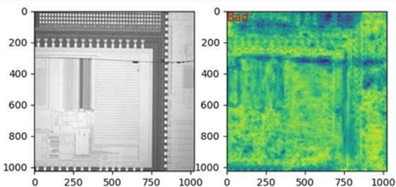
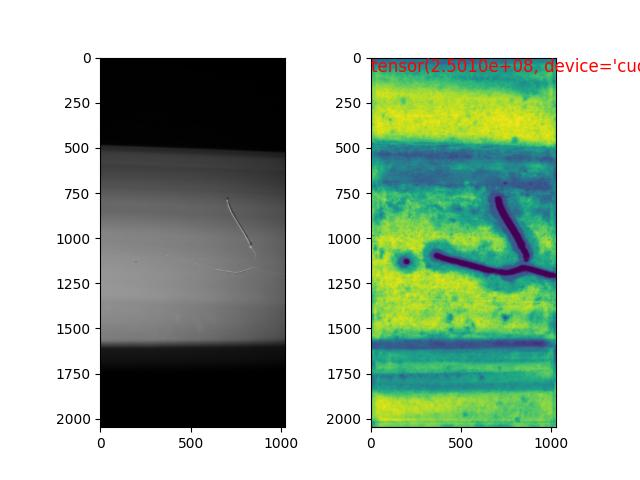
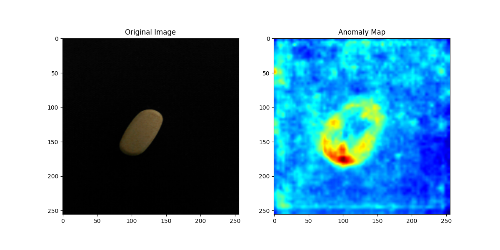
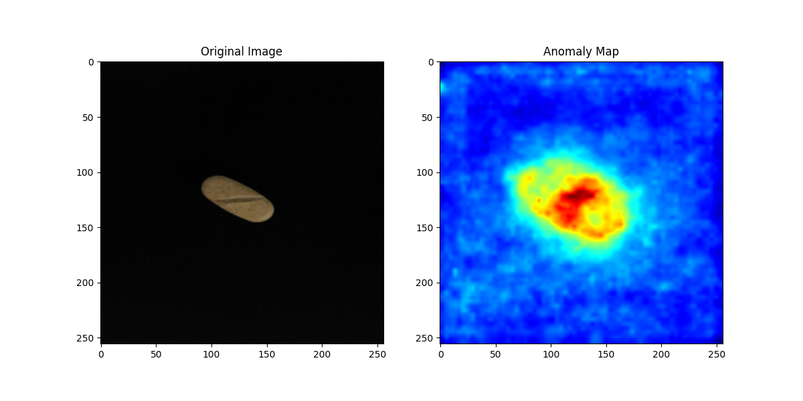
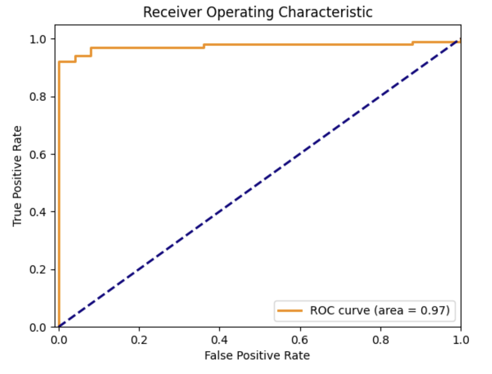

# 🧠 FastFlow-based Automated Visual Inspection

> **비지도 학습 기반 시각 이상 탐지 모델인 FastFlow**를 활용하여, 제품의 품질을 자동으로 검사하는 시스템입니다.  
> 본 프로젝트는 직접 촬영한 알약 이미지를 기반으로 실험을 수행했지만,  
> 모델 구조와 파이프라인은 전자부품, 식품, 금속 가공품 등 다양한 산업의 제품 이미지에도 그대로 적용 가능합니다.

---

## 🔍 프로젝트 개요

- 🎯 **목표**: 별도의 결함 라벨 없이 제품의 외관 이상을 자동 탐지하고 시각화
- 🧠 **모델**: [FastFlow](https://arxiv.org/abs/2111.07677) – ResNet 기반 feature extractor + 2D Normalizing Flow
- 🖼️ **데이터**: **직접 촬영한 알약 이미지**, 정상만을 학습 데이터로 사용
- 📈 **응용 분야**: 제약, 반도체, 금속 부품, 식품 포장 등 모든 시각 기반 품질 검사

---

## 🧠 사용 기술

| 범주       | 사용 기술 |
|------------|-----------|
| 언어       | Python 3.8+ |
| 프레임워크 | PyTorch, OpenCV |
| 시각화     | Matplotlib, PIL |
| 환경       | CUDA-enabled GPU (optional) |

---


## 🖼️ 도메인별 이상 탐지 이미지 예시

| 도메인 | 결함 이미지 예시 |
|--------|------------------|
| 🧩 반도체 |  |
| 🪟 창호 |  |


## 📈 알약 이미지 기반 이상 탐지 결과

| 정상 이미지 | 이상 이미지 | 탐지 결과 (ROC_CURVE) |
|-------------|-------------|---------------------|
|  |  |  |

> 📸 위 이미지는 알약을 직접 촬영하여 구성하였으며, 모델은 다양한 제품 도메인에 재사용 가능합니다.

---

## 📊 주요 결과

- ✅ 정상 vs 비정상 분류 정확도: **97%**
- 🧠 결함 Heatmap 시각화 정확도: 높은 시각 일치율
- 🧩 라벨링 없는 비지도 학습 방식으로 **데이터 수집 및 적용 비용 절감**

---

## 🚀 실행 방법

```bash
# 환경 구성
pip install -r requirements.txt

# 모델 학습
python main.py --train --data_dir ./dataset/train

# 테스트 및 이상 탐지
python main.py --test --data_dir ./dataset/test --model_path ./checkpoint_dir/exp5/99.pt


anomaly_detection/
├── assets/                         # README용 이미지
│   ├── positive.jpg
│   ├── negative.jpg
│   └── heatmap_result.png

├── checkpoint_dir/                # 실험별 모델 저장
│   ├── exp1/ ~ exp5/
│       └── 99.pt, output.txt

├── results/                       # 탐지 결과
│   └── anomaly_map/
│       ├── bad/    → 이상 이미지 결과
│       └── good/   → 정상 이미지 결과

├── image_capture/                 # 실시간 이미지 캡처 관련

├── main.py                        # 메인 실행 파일
├── fastflow.py                    # FastFlow 모델 정의
├── dataset.py                     # 데이터 로딩 처리
├── utils.py, constants.py         # 보조 기능 및 상수
├── image_capture.py               # 이미지 캡처 모듈
├── find_threshold.py              # 임계값 추정 도구
├── realtime_plotting.py           # 실시간 그래프
├── singleton.py, test.py          # 실험 관련 파일
├── README.md, .gitignore
├── commend.txt, output.txt        # 실행 로그/설정 기록
├── *.jpg / *.png                  # 입력 이미지 샘플
└── __pycache__/                   # Python 캐시
